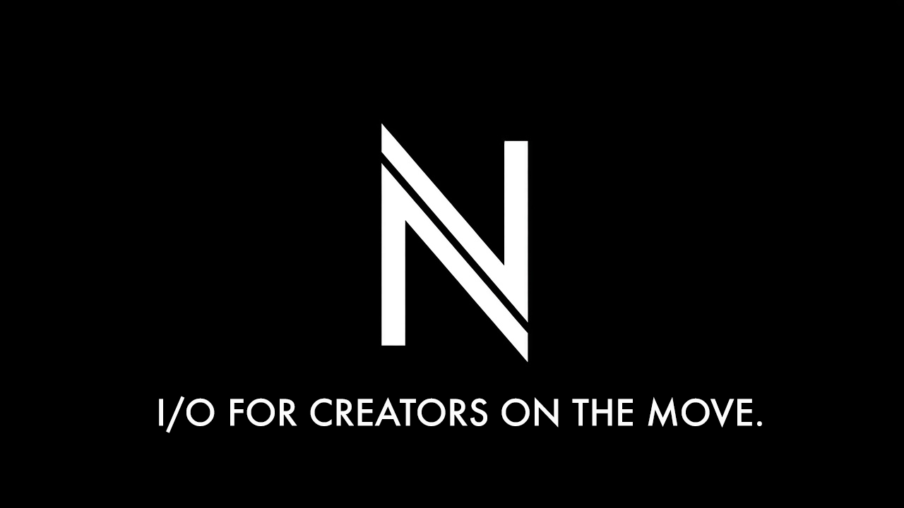

<p align="center">
  
</p>

# NomadIO

You can't watch your own stream while you're in it. NomadIO watches from the receiving end and
answers, on your phone: am I live, is it good, what broke.

## Why it's worth building

A dropped IRL stream costs the audience twice. The viewers who leave during the dead minutes
mostly do not come back that session, and the streamer keeps walking and talking for ten minutes
before noticing, because the phone is still showing them a camera preview and a green light. The
gap between "my stream broke" and "I know my stream broke" is the single most expensive thing in
solo mobile streaming, and it is a monitoring problem, not a bandwidth one.

The existing answers are a hardware bonding encoder in the four-figure range, a laptop in a
backpack, or a second person watching the stream and texting you. NomadIO is the software answer
for the person who has an iPhone, a mount, a mic and one SIM, and it costs a container on a
machine they already own.

It is deliberately not an encoder, a bonder or a mixer. Those markets are served. What nobody
sells is the honest instrument panel across all of them, and once that panel exists it is also
the natural place to put the controls, the overlay and eventually the automation, because it is
already the thing that knows the state of the whole chain.

## Install and run

```bash
cp .env.example .env && npm install && npm run dev    # API :4000, dashboard :3000
```

It starts on mock data, so you see the whole thing before touching the rig. Point it at your own
ingest from the Setup tab.

## Roadmap

**1. Viewer** — where it is now.

A phone app that tells an ordinary streamer what their stream is actually doing. Live or not,
bitrate, FPS, latency, packet loss, dropped frames, every outage with its duration, how much data
the session has eaten, phone battery. A go-live checklist for the steps a phone cannot check for
you, and a button that writes a timestamp when something happens worth cutting to later. It reads
and it warns; it never touches the stream.

**2. Connected** — the whole chain in one view.

Two SIMs and a bonding box, so you can see which link is carrying the stream and the moment it
failed over, instead of guessing why the picture broke. Alongside it, the OBS running on the home
PC: scenes, audio levels, encoder drops. The dashboard stops being a mirror of one number and
becomes a window into every hop between the camera and the viewer.

**3. Control** — the toolkit, wherever you are.

Switch scene, go BRB, start and stop the broadcast, push an overlay, all from the phone hanging
on your chest, over whatever network you happen to have. Against your own OBS or a hosted one,
publishing to YouTube or Twitch or Kick. Swapping any of those is a config change, because each
one sits behind an interface rather than being wired through the app.

**4. Context** — the stream knows where it is.

Route, distance travelled, ascent, speed, altitude, battery and signal on the overlay, fed by the
phone. A walk stops being a shaky camera and becomes something with a shape a viewer can follow.
Precise location is off by default and stays that way unless you turn it on deliberately, because
a live map of where you are standing is not a feature you want on by accident.

**5. Agentic** — the long one, and the part that may turn out to be nonsense.

A system that reads the stream instead of only measuring it: steps quality down before a drop
rather than after, cuts the markers into clips on its own, drafts the descriptions, schedules the
uploads, and keeps one person's whole content pipeline running while that person is outside doing
the thing worth filming. Every layer under it stands on its own, so if this never arrives nothing
below it was wasted.

Out of scope on purpose: reimplementing bonding, DJI Mini 4 telemetry, audio processing.

## Stack

React and Vite for the PWA, Node and Fastify for the collector, one zod contract shared by both
so it cannot drift, and one provider per vendor so Speedify, OBS and YouTube are each swappable.

```bash
docker compose up --build     # or podman compose
npm test && npm run typecheck
```

Docs: [architecture](docs/01-architecture.md),
[what each device can actually report](docs/02-data-availability.md),
[roadmap](docs/04-roadmap.md), [brand](docs/05-brand.md),
[design system](DESIGN.md).

## License

Source-available, not open source. Read and evaluate it freely; real use needs permission,
so [ask](https://github.com/thevangelist/nomadio/issues). See [LICENSE](LICENSE).

<sub>Greek <em>nomás</em> (νομάς), a herder who keeps moving, plus I/O.</sub>
